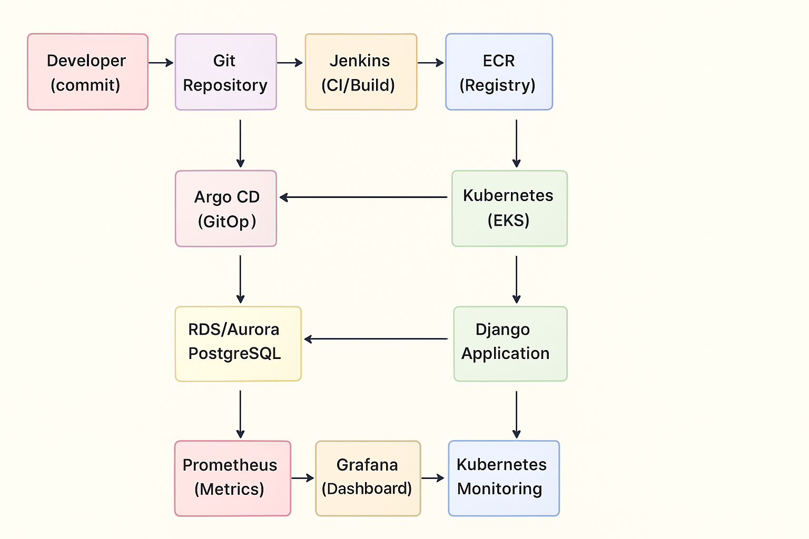

# 🚀 DevOps CI/CD Platform

**CI/CD Stack: Jenkins + Argo CD + Terraform + RDS + Prometheus + Grafana**

---

## 📖 Опис проєкту

Цей проєкт реалізує повний **CI/CD процес** для Django застосунку з інфраструктурою на AWS та вбудованим моніторингом:

- **Terraform** → управління інфраструктурою (IaC)
- **Jenkins** → Continuous Integration (збірка та публікація Docker образів)
- **Argo CD** → Continuous Deployment (GitOps підхід)
- **Kubernetes (EKS)** → оркестрація контейнерів
- **Helm** → управління Kubernetes-конфігураціями
- **RDS/Aurora** → база даних PostgreSQL
- **Prometheus** → збір та збереження метрик
- **Grafana** → візуалізація даних та моніторинг

---

## Архітектура системи



## Структура проєкту

```
📁 my-microservice-project
├── .gitignore
├── README.md
├── assets
    ├── .gitkeep
    ├── schema.png
├── backend.tf
├── charts
    └── django-app
    │   ├── Chart.yaml
    │   ├── templates
    │       ├── _helpers.tpl
    │       ├── configmap.yaml
    │       ├── deployment.yaml
    │       ├── hpa.yaml
    │       └── service.yaml
    │   └── values.yaml
├── kubernetes-secrets.yaml.template
├── main.tf
├── modules
    ├── argo_cd
    │   ├── argo_cd.tf
    │   ├── charts
    │   │   ├── Chart.yaml
    │   │   ├── templates
    │   │   │   ├── application.yaml
    │   │   │   └── repository.yaml
    │   │   └── values.yaml
    │   ├── outputs.tf
    │   ├── providers.tf
    │   ├── values.yaml
    │   └── variables.tf
    ├── ecr
    │   ├── ecr.tf
    │   ├── outputs.tf
    │   └── variables.tf
    ├── eks
    │   ├── aws_ebs_csi_driver.tf
    │   ├── eks.tf
    │   ├── outputs.tf
    │   └── variables.tf
    ├── jenkins
    │   ├── jenkins.tf
    │   ├── outputs.tf
    │   ├── providers.tf
    │   ├── values.yaml
    │   └── variables.tf
    ├── monitoring
    │   ├── monitoring.tf
    │   ├── outputs.tf
    │   ├── providers.tf
    │   ├── values
    │   │   ├── grafana-values.yaml
    │   │   └── prometheus-values.yaml
    │   └── variables.tf
    ├── rds
    │   ├── aurora.tf
    │   ├── outputs.tf
    │   ├── rds.tf
    │   ├── shared.tf
    │   └── variables.tf
    ├── s3-backend
    │   ├── dynamodb.tf
    │   ├── outputs.tf
    │   ├── s3.tf
    │   └── variables.tf
    └── vpc
    │   ├── outputs.tf
    │   ├── routes.tf
    │   ├── variables.tf
    │   └── vpc.tf
└── outputs.tf
```

## 📊 Модуль моніторингу (Prometheus + Grafana)

### Функціонал:

Збір Kubernetes-метрик (kube-state-metrics)

- **Prometheus** – сховище даних

- **Grafana** – готові дашборди

- **Persistent Storage** - для збереження історії

- **LoadBalancer** - доступ до сервісів

### Приклад використання:

```terraform
module "monitoring" {
  source = "./modules/monitoring"

  cluster_name     = module.eks.cluster_name
  cluster_endpoint = module.eks.cluster_endpoint
  namespace        = "monitoring"

  prometheus_storage_size = "20Gi"
  grafana_storage_size    = "5Gi"
  grafana_admin_password  = "Admin12345!!"

  depends_on = [module.eks]
}
```

## ☁️ Створювана інфраструктура

### AWS Ресурси

- **EKS Cluster (v1.28) + EC2 Node Group**
- **VPC** (публічні/приватні підмережі)
- **ECR** (Docker registry)
- **RDS Aurora PostgreSQL** (база даних)
- **S3 + DynamoDB** (Terraform state & locking)
- **IAM ролі, EBS CSI Driver, LoadBalancer**

### Kubernetes Ресурси

- **Jenkins** (CI, Kaniko build)
- **Argo CD** (GitOps CD)
- **Django App** (HPA scaling)
- **Prometheus + Grafana** (моніторинг)
- **Persistent Volumes** для всіх stateful сервісів

## 🔧 Передумови

### Встановлені інструменти:

1. **AWS CLI** з налаштованими credentials
2. **Terraform** (версія >= 1.0)
3. **kubectl** для роботи з Kubernetes
4. **Helm 3** для розгортання charts
5. **Git** для роботи з репозиторіями

### AWS Permissions:

- EKS повні права
- EC2 повні права
- IAM створення ролей
- S3 та DynamoDB права
- ECR повні права
- RDS повні права
- **ELB повні права** (для LoadBalancers)

## ⚙️ Розгортання проєкту

1. Підготовка середовища

```bash
aws configure
aws sts get-caller-identity

git clone https://github.com/IrynaSabinina/my-microservice-project.git
cd my-microservice-project
git checkout final-project
terraform init
terraform plan
```

2. Розгортання інфраструктури

```bash
terraform apply
```

Налаштування kubectl:

```bash
aws eks update-kubeconfig --region us-east-1 --name lesson-6-eks-cluster
kubectl get nodes
```

## 🔍 Перевірка сервісів

```bash
kubectl get all -n jenkins
kubectl get all -n argocd
kubectl get all -n monitoring
kubectl get svc --all-namespaces | grep LoadBalancer
```

Отримання LoadBalancer URLs:

```bash
echo "Prometheus: $(kubectl get svc prometheus-server -n monitoring -o jsonpath='{.status.loadBalancer.ingress[0].hostname}')"
echo "Grafana: $(kubectl get svc grafana -n monitoring -o jsonpath='{.status.loadBalancer.ingress[0].hostname}')"
echo "Jenkins: $(kubectl get svc jenkins -n jenkins -o jsonpath='{.status.loadBalancer.ingress[0].hostname}'):8080"
echo "Argo CD: $(kubectl get svc argocd-server -n argocd -o jsonpath='{.status.loadBalancer.ingress[0].hostname}')"
```

## 📈 Моніторинг

#### **Grafana LoadBalancer:**

1. **Відкрийте Grafana через LoadBalancer URL**
2. **Login:** `admin` / використайте пароль з команди вище
3. **Перевірте попередньо налаштовані дашборди:**
   - Kubernetes Overview Dashboard
   - Node Metrics Dashboard
   - Pod Metrics Dashboard

#### Prometheus перевірка:

1. **Відкрийте Prometheus через LoadBalancer URL**
2. **Перевірте метрики:**
   ```
   up                    # Статус всіх цілей моніторингу
   kube_node_info       # Інформація про ноди
   kube_pod_info        # Інформація про поди
   ```

### **5. Перевірка стану метрик в Grafana Dashboard:**

1. **Увійдіть в Grafana**
2. **Перейдіть до Dashboards**
3. **Перевірте дашборди:**

   - Kubernetes Overview - загальна інформація про кластер
   - Node Metrics - метрики вузлів
   - Pod Metrics - метрики подів
   - Prometheus Stats - статистика самого Prometheus

4. **Перевірте, що дані надходять:**
   - Графіки показують актуальні дані
   - Метрики оновлюються в реальному часі
   - Немає помилок у збору даних

## ✅ Результати

- **Повний CI/CD стек на AWS**
- **Django застосунок у Kubernetes (EKS)**
- **GitOps деплоймент через Argo CD**
- **Моніторинг у реальному часі (Prometheus + Grafana)**
- **Production-ready архітектура**
